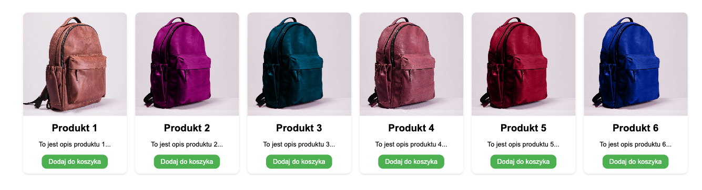
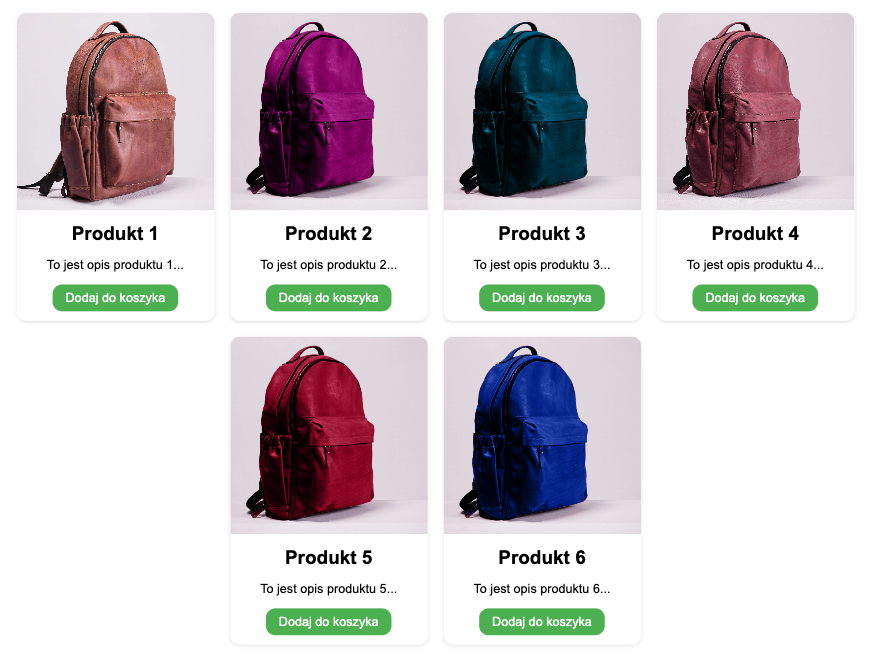
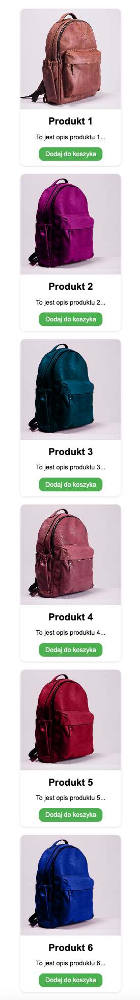

# Projekt - portfolio
[Kliknij tutaj aby rozwiązać zadanie](https://githubbox.com/Publishing-School/css-flexbox-cwiczenie)

Zadanie polega na ulepszeniu układu strony z kartami produktów, korzystając z CSS, aby strona była bardziej responsywna i estetycznie prezentowała się na różnych urządzeniach. Chcemy, aby karty produktów były wyświetlane obok siebie, ale również elastycznie dostosowywały się do szerokości ekranu, przechodząc do nowego wiersza, gdy brakuje miejsca. Dodatkowo, karty te powinny być centrowane w kontenerze..

Sam układ karty produktu powinien wyśrodkować elementy względem siebie, oraz zapewnić równy odstęp między nimi. 

Rozważ, jakie właściwości CSS można zastosować do kontenera i kart, aby osiągnąć opisany układ.

Rozwiązanie - pełna szerokość

Rozwiązanie - tablet

Rozwiązanie - smartfon
